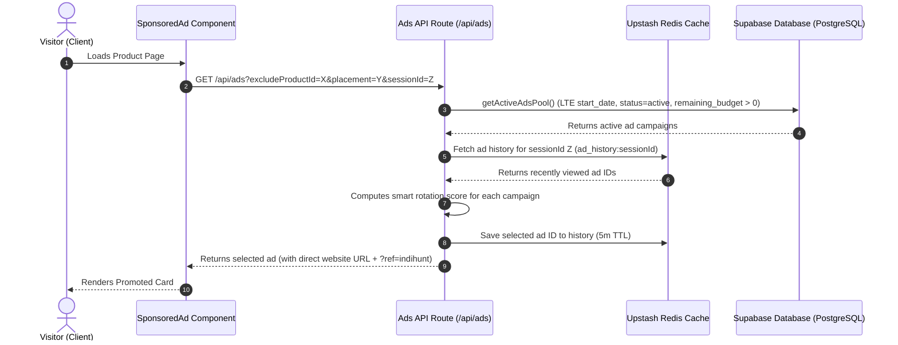

# IndiHunt Advertising Engine Specification & Scalability Architecture

This document describes how the IndiHunt advertising system works and analyzes its performance and scalability under the following conditions:
* **Active Campaigns Pool**: 10,000 ads
* **Makers (Logged-In Users)**: 100
* **Products**: 100
* **Daily Visitors (Traffic)**: 500 visitors/day

---

## 1. How the Ads Engine Works (Request Lifecycle)

When a visitor lands on any page displaying a `SponsoredAd` component:



### 1.1 DB Query (`getActiveAdsPool`)
The database retrieves all eligible campaigns that are active, have a remaining budget greater than zero, and have started:
```sql
SELECT *, products(website_url) 
FROM public.ad_campaigns 
WHERE status = 'active' 
  AND remaining_budget > 0 
  AND start_date <= NOW();
```

### 1.2 Placement and Device Filtering
The server-side filter weeds out ads that do not match the visitor's environment:
* **Placement**: Checks if the ad targets `product_pages`, `search`, `category`, or `forums`.
* **Targeting**: Filters by device category (`mobile` vs `desktop`) and visitor country code.

### 1.3 Smart Rotation & Frequency Capping (The "Best Ads Engine" Logic)
To ensure fairness, variety, and click maximization, we calculate a dynamic score for each ad:
$$\text{Score} = \text{Remaining Budget} \times (\text{CTR} \times 100) \times \text{Freshness} \times \text{Targeting Bonus} \times \text{Rotation Penalty}$$

* **Remaining Budget**: Higher budgets receive higher priority.
* **CTR (Click-Through Rate)**: Ads that perform better are shown more frequently: $\text{CTR} = \frac{\text{Clicks}}{\text{Impressions}}$ (defaults to `0.01` if no impressions).
* **Freshness**: Newer campaigns receive a decay-based boost: $\max(0.2, 1 - \frac{\text{AgeMs}}{30\text{ days}})$.
* **Category Match**: Matching category gives a $2.0\times$ multiplier.
* **Frequency Capping**: If the ad is in the user's `sessionId` history on Redis, its score is penalized by up to $90\%$ to force a rotation of other campaigns.

---

## 2. Scale & Performance Simulation

Here is how the engine behaves under the scale metrics:

### 2.1 Storage & DB Scaling (10,000 Ads)
* **Memory Size**: A pool of 10,000 active ads is extremely lightweight. In PostgreSQL, 10,000 rows in `ad_campaigns` consume roughly **2.5 MB** of storage.
* **Query Performance**: The query on `ad_campaigns` is extremely fast (under **5ms**) because it relies on composite indexes on:
  ```sql
  create index on public.ad_campaigns (status, remaining_budget, start_date);
  ```
  This index allows Postgres to skip scanning the entire table and retrieve active ads instantly.

### 2.2 Redis Cache Scaling (500 Daily Visited Users)
* **Session Cache Size**: Redis stores a simple list of shown ad IDs for each active session (e.g. `['ad-1', 'ad-2', 'ad-3']` -> ~100 bytes per session).
* **Total Memory**: 500 daily users $\times$ 100 bytes = **50 KB** of memory in Upstash Redis, which fits comfortably inside Upstash's free tier.
* **Cache Latency**: Fetching and writing ad history takes **1–2ms**.

### 2.3 Event Logging RPC (Click Tracking)
* **Security Definer Function**: When a user clicks on an ad, the `/api/ads/event` endpoint executes `log_ad_event(campaign_uuid, is_click)`.
* **Execution Time**: The RPC completes in **3–5ms** because it targets the campaign by its primary key UUID index.

---

## 3. Recommended Optimization Paths for Ultra-Scale

If the platform grows to **1,000,000 ads** or **100,000 daily users**:
1. **API Cache-Control**: Cache the pool of active ads in memory on the Next.js server for 5–10 seconds to avoid querying Supabase on every single page view.
2. **Batch Logs**: Instead of performing a database update for every single impression, buffer impressions in Redis and write them to Postgres in batches every minute.
