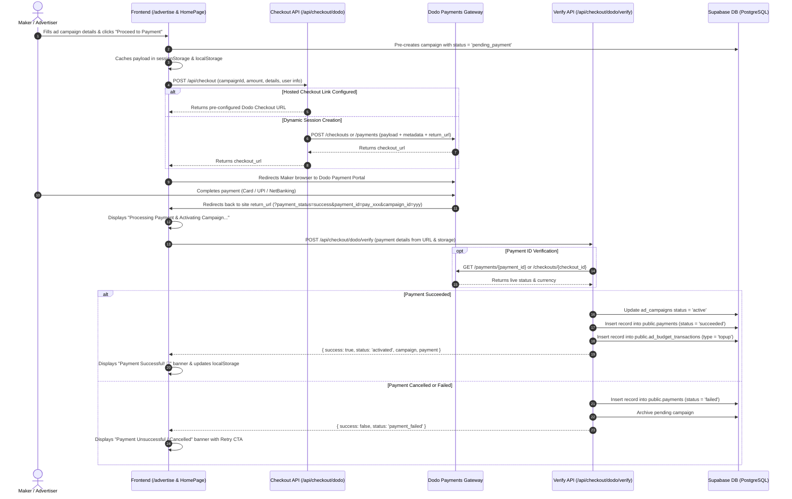

# IndiHunt Payments Engine & Implementation Architecture

This document provides a comprehensive breakdown of the payment infrastructure implemented in **IndiHunt**, detailing the architecture, payment flows, API routes, database schemas, frontend integration, admin management, and security controls.

---

## 1. Overview & Merchant of Record (MoR)

IndiHunt uses **Dodo Payments** as its primary Merchant of Record (MoR). 

### Why Dodo Payments?
- **Indian & Global Reach**: Native support for Indian payment instruments (UPI, Net Banking, Indian cards) along with seamless international card processing (Visa, Mastercard, Amex).
- **Merchant of Record Compliance**: Handles cross-border sales tax, GST, invoicing, currency conversion, and regulatory compliance out of the box.
- **Developer-Friendly Webhooks & Verification APIs**: Enables verification of transactions before activating paid services (such as ad campaigns and billboard placements).

---

## 2. End-to-End Payment Lifecycle

Below is the complete sequence diagram illustrating how a user purchases an ad campaign on IndiHunt:



---

## 3. Core Components & File Structure

| File | Purpose |
|---|---|
| `src/app/api/checkout/route.ts` | Central gateway router. Dispatches checkout requests to active gateway (Dodo). |
| `src/app/api/checkout/dodo/route.ts` | Creates Dodo checkout sessions or builds hosted checkout URLs with campaign metadata. |
| `src/app/api/checkout/dodo/verify/route.ts` | Server-side payment verification endpoint with Dodo API confirmation and database persistence. |
| `src/app/advertise/page.tsx` | 5-step interactive campaign creation wizard with checkout initiation. |
| `src/app/HomePageClient.tsx` | Handles return URL query parameters, displays status banners, and triggers payment verification. |
| `src/app/admin/_actions/payment-actions.ts` | Server actions for admin manual payment recording, refunds, and audit logging. |
| `src/app/admin/(management)/payments/` | Admin payment management UI, transaction logs, and revenue metrics. |
| `supabase/migrations/86_migrate_to_dodo_payments.sql` | SQL schema migration for payments table, RLS policies, and indexes. |

---

## 4. API Endpoints Specification

### 4.1 Gateway Router: `POST /api/checkout`
- Acts as a unified facade for payment requests.
- Checks payment gateway configurations via `getPaymentGatewayConfig()`.
- Routes incoming payload to `POST /api/checkout/dodo`.

### 4.2 Checkout Initiation: `POST /api/checkout/dodo`
Handles two modes:
1. **Hosted Checkout Link** (if `DODO_CHECKOUT_LINK` or `NEXT_PUBLIC_DODO_CHECKOUT_LINK` is defined):
   - Appends metadata (`campaignId`, `productId`, `userId`, `email`, `fullName`, `redirect_url`) to the query parameters.
   - Returns `{ url: string, provider: "dodo", campaignId }`.
2. **API Session Generation** (via `DODO_PAYMENTS_API_KEY`):
   - Detects environment: `https://test.dodopayments.com` vs `https://live.dodopayments.com`.
   - Sends payload to `POST /checkouts` with customer billing info, return URL, and full campaign metadata.
   - Falls back to `POST /payments` if `/checkouts` is not configured for the account.
   - Returns `{ url: sessionData.checkout_url, provider: "dodo", campaignId }`.

### 4.3 Payment Verification & DB Activation: `POST /api/checkout/dodo/verify`
Accepts payment information from the client redirect and validates it:
1. **Server-Side Gateway Check**:
   - If `paymentId` starts with `pay_` or `checkoutId` starts with `chk_`/`sess_`, queries Dodo's REST API:
     `GET /payments/{paymentId}` or `GET /checkouts/{checkoutId}`.
2. **Fraud / Failure Guard**:
   - Checks if Dodo returned a non-success status (`failed`, `cancelled`, `refunded`, `expired`, `declined`, `error`).
   - If payment failed, records a failed transaction in `public.payments` for audit purposes and marks the `pending_payment` campaign as `archived`. Rejects activation with HTTP 400.
3. **Database Persistence**:
   - **Campaign Update**: If `campaignId` exists, updates status from `pending_payment` to `active`, updates budget and target impressions. If not yet in DB, inserts a new campaign into `public.ad_campaigns`.
   - **Payment Audit Table**: Inserts a new record in `public.payments` with `status: 'succeeded'`, payment method `'dodo'`, transaction metadata, and timestamps.
   - **Budget Transaction Table**: Inserts an audit row into `public.ad_budget_transactions` with `transaction_type: 'topup'`.
4. **Fallback Handling**:
   - If the database write fails or is running in an offline dev environment, returns a synthesized campaign object so the user interface can continue without blocking.

---

## 5. Database Schema & Policies

### 5.1 `public.payments` Table
Defined in `supabase/migrations/86_migrate_to_dodo_payments.sql`:

```sql
create table if not exists public.payments (
  id uuid default gen_random_uuid() primary key,
  user_id uuid references public.profiles(id) on delete cascade not null,
  campaign_id uuid references public.ad_campaigns(id) on delete set null,
  dodo_payment_id text,
  dodo_customer_id text,
  amount numeric(10, 2) not null,
  currency text default 'usd' not null,
  status text default 'succeeded' not null, -- succeeded, pending, failed, refunded
  payment_method text default 'dodo' not null,
  metadata jsonb default '{}'::jsonb not null,
  created_at timestamp with time zone default timezone('utc'::text, now()) not null
);
```

#### Indexes:
- `idx_payments_user_id` on `public.payments(user_id)`
- `idx_payments_campaign_id` on `public.payments(campaign_id)`
- `idx_payments_dodo_payment_id` on `public.payments(dodo_payment_id)`

#### Row Level Security (RLS) Policies:
1. **Users can view their own payments**: `auth.uid() = user_id`
2. **Users can insert their own payments**: `auth.uid() = user_id`
3. **Admins can view all payments**: Checked against `public.profiles.role = 'admin'`

### 5.2 `public.ad_campaigns` Integration
Stores the association between the marketing ad and the billing transaction:
- `dodo_payment_id`: ID of the successful payment transaction.
- `dodo_customer_id`: Dodo customer identifier.
- `status`: Transitions from `pending_payment` to `active` upon successful verification.

### 5.3 `public.ad_budget_transactions` Ledger
Records every credit addition and impression deduction for transparent accounting:
- `campaign_id`: References the ad campaign.
- `user_id`: Advertiser user ID.
- `payment_id`: References `payments.id`.
- `amount`: Top-up amount.
- `transaction_type`: `'topup'`.

---

## 6. Frontend User Flow & State Management

### 6.1 Campaign Wizard (`/advertise`)
1. **Step 1: Campaign Details**: Name, headline, description, call-to-action text, destination URL.
2. **Step 2: Product Association**: Maker selects their registered IndiHunt product or provides a direct link.
3. **Step 3: Budget & CPM Selection**: Sets budget (e.g. ₹350 / ₹1,000 / custom), calculating target impressions.
4. **Step 4: Campaign Objective**: Traffic, brand awareness, or signups.
5. **Submission**:
   - Pre-saves campaign in Supabase with `status: "pending_payment"`.
   - Saves payload to `sessionStorage` (`ih_pending_ad_campaign`) and `localStorage` (`indihunt_ad_campaigns`).
   - Requests checkout URL from `/api/checkout` and redirects browser to Dodo portal.

### 6.2 Post-Payment Return Flow (`HomePageClient.tsx`)
When Dodo redirects the user back to `/?payment_status=success...`:
1. `HomePageClient` detects `payment_status` in URL params.
2. Displays an immediate floating banner: `"Processing Payment & Activating Campaign..."`.
3. Calls `/api/checkout/dodo/verify` with payment parameters.
4. On success:
   - Updates local state and `indihunt_payments` in `localStorage`.
   - Displays success banner: `"Payment Successful! 🎉 Your ad campaign is now active."`
   - Cleans up URL search parameters without a full page reload via `window.history.replaceState`.
5. On failure or cancellation:
   - Displays failure banner: `"Payment Unsuccessful or Cancelled"` with a retry link.

---

## 7. Admin Features & Operations

Admin payment tools live under `/admin/payments` powered by `src/app/admin/_actions/payment-actions.ts`:
- **Manual Payment Recording**: Admins can log manual payments (bank transfers, sponsorships, promotional credits) via `adminRecordManualPayment`.
- **Campaign Credit Top-ups**: Automatically adjusts campaign balance and impressions when recording payments against an existing `campaign_id`.
- **Refund Processing**: `adminProcessRefund` updates the payment status to `'refunded'`, pauses or adjusts campaign budget, and logs the action.
- **Audit Logging**: Every action writes to the admin audit log (`logAuditEntry`) with IP, admin identity, and previous/new states.

---

## 8. Configuration & Environment Variables

| Variable | Description | Example / Allowed Values |
|---|---|---|
| `DODO_PAYMENTS_API_KEY` | Secret API key from Dodo Payments dashboard | `test_xxx` or `live_xxx` |
| `DODO_ENVIRONMENT` | Environment toggle | `test` / `live` |
| `DODO_PRODUCT_ID` | Pre-created Product ID in Dodo Payments | `p_xxx` |
| `DODO_CHECKOUT_LINK` | Optional hosted checkout link from Dodo | `https://test.dodopayments.com/buy/p_xxx` |
| `NEXT_PUBLIC_DODO_CHECKOUT_LINK` | Client-accessible hosted checkout link fallback | Same as above |
| `NEXT_PUBLIC_SITE_URL` | Application root URL for redirect callbacks | `https://indihunt.in` or `http://localhost:3000` |
| `SUPABASE_SERVICE_ROLE_KEY` | Server key to bypass RLS during webhook/verification | `eyJ...` |
| `NEXT_PUBLIC_SUPABASE_URL` | Supabase project URL | `https://xyz.supabase.co` |
| `NEXT_PUBLIC_SUPABASE_ANON_KEY` | Supabase public anonymous key | `eyJ...` |

---

## 9. Security & Resilience Best Practices

1. **Server-Side API Verification**: Never trust front-end URL parameters alone (`?payment_status=success`). The backend always verifies the payment status directly with Dodo's server (`/payments/{id}`) when an API key is present.
2. **Idempotent Updates**: Verification safely checks for existing campaigns before inserting duplicates, allowing top-ups if the campaign already exists.
3. **Promise & Type Safety**: All Supabase calls in verification routes use standard `try/catch` blocks around Postgrest builders, preventing unhandled promise rejections.
4. **Local Development Resilience**: If running locally without live Supabase credentials or offline, the system safely falls back to `localStorage` caches so development and UI testing are never blocked.
