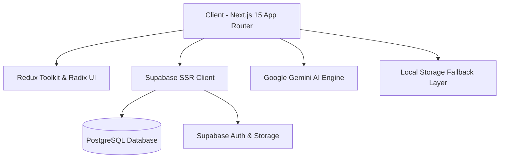

# IndiHunt 🇮🇳 🚀

> The Premier Indie Maker Launchpad & Discovery Platform for Indian Software Builders.  
> Launch your product, rally community upvotes, climb the daily leaderboards, and put your startup on the global stage.  
> *Backed by the Indian Indie Tech Community*

[](https://nextjs.org/)
[](https://react.dev/)
[](https://www.typescriptlang.org/)
[](https://tailwindcss.com/)
[](https://supabase.com/)
[](https://redux-toolkit.js.org/)
[](https://ai.google.dev/)
[](https://github.com/)
[](https://github.com/)
[](LICENSE)

---

## 🏷️ Official IndiHunt Badges

Makers launching on **IndiHunt** can display these badges on their GitHub repositories and landing pages:

| Badge Type | Live Preview | Markdown Code |
|---|:---:|---|
| **Featured on IndiHunt** | [](#) | `[](https://indihunt.vercel.app)` |
| **#1 Product of the Day** | [](#) | `[](https://indihunt.vercel.app)` |
| **Top 5 Product** | [](#) | `[](https://indihunt.vercel.app)` |
| **Find Us on IndiHunt** | [](#) | `[](https://indihunt.vercel.app)` |
| **Maker on IndiHunt** | [](#) | `[](https://indihunt.vercel.app)` |

---

## 🌟 Key Features

### 🏢 1. Algorithmic Featuring & Quality Scoring Engine
- **Quality Score (0–100 pts)**: Evaluates website responsiveness, logo presence, 3+ screenshots, video demos, detailed descriptions, social accounts, and verified maker identities.
- **Engagement Score**: Dynamically weighted calculation:
  $$\text{Score} = (\text{upvotes} \times 3) + (\text{comments} \times 5) + (\text{bookmarks} \times 2) + \left(\frac{\text{views}}{20}\right)$$
- **Auto-Promotion Rules**: High-quality builds (Score $\ge 80$) with organic community velocity ($\ge 20$ upvotes, $\ge 5$ comments) within 12h earn automatic homepage featuring.

### 🚀 2. Product Launch Wizard & Pre-Launch Scheduler
- **Multi-Step Onboarding**: Add rich media assets, category tags, pricing models, pitch decks, and maker social profiles.
- **Pre-Launch Mode**: Build anticipation with countdowns, subscriber capture, and scheduled launch dates.
- **Alternatives & Stack Tracker**: Tag open-source alternatives and show community-curated tech stacks.

### 📊 3. Real-Time Discovery Feed & Timeframe Filters
- **Interactive Feed Views**: Switch seamlessly across `Featured`, `Trending`, and `All Products`.
- **Granular Time Filtering**: Filter by `Today`, `Yesterday`, `This Week`, or `This Month`.
- **Paginated Performance**: Optimized 20-item pagination with native ad banner placement after the 5th product.

### 💬 4. Community Forums, Threads & Maker Stories
- **Deep Discussions**: Category-driven forum discussions with markdown support and upvotes.
- **Maker Stories**: Long-form builder logs, retrospectives, revenue milestones, and changelogs.
- **Embedded Product Cards**: Integrated discussion threads linked directly inside product detail pages.

### 🛡️ 5. Real-Time Content Moderation Guard
- **Automated Anti-Spam**: Intelligent pattern checks filtering promotional URL injections and abusive phrases across comments, reviews, and forum threads.
- **Multi-Criteria Reviews**: Deep product reviews covering *Ease of Use*, *Reliability*, and *Value for Money*.

### 📢 6. Self-Serve Ad Engine & Karma Leaderboard
- **Campaign Dashboard**: In-app advertising wizard for sponsors (Basic, Momentum, Managed tiers).
- **Maker Karma & Leaderboard**: Global maker ranking based on products hunted, comments made, and peer awards.

---

## 🛠️ Architecture & Tech Stack



| Layer | Technology | Details |
|---|---|---|
| **Framework** | Next.js 15 (App Router) | Server components, dynamic routes, optimized metadata |
| **Language** | TypeScript 5 | Strict types across models, API responses, and Redux slices |
| **Styling** | TailwindCSS & Lucide | Modern dark/light UI tokens, responsive layouts, clean icons |
| **State** | Redux Toolkit | Predictable client state management |
| **Database** | Supabase (PostgreSQL) | Scalable RLS-protected relational schema with 100k+ ready indexes |
| **AI Integration** | Google Gemini API | Automated product pitch summaries, category suggestions |
| **Reliability** | Offline / LocalStorage Mode | Seamless zero-config local development without live backend |

---

## 📁 Directory Structure

```
indihunt/
├── src/
│   ├── app/
│   │   ├── page.tsx              # Main feed with tabs, filters & pagination
│   │   ├── products/[id]/        # Product showcase, reviews & scoring sidebar
│   │   │   ├── review/           # Multi-criteria review wizard
│   │   │   └── pre-launch/       # Pre-launch countdown page
│   │   ├── stories/[id]/         # Maker stories with threaded comments
│   │   ├── threads/[id]/         # Community discussion thread detail
│   │   ├── discussions/          # Community forum categories
│   │   ├── profile/              # Maker profiles, collections & campaigns
│   │   ├── new/                  # Product launch wizard
│   │   ├── best-products/        # Top products leaderboard
│   │   ├── awards/               # Community awards & honors
│   │   ├── advertise/            # Self-serve ad campaign manager
│   │   └── changelog/            # Platform version history
│   ├── lib/
│   │   ├── supabase.ts           # Unified DB queries, types, mock data & scoring
│   │   ├── gemini.ts             # Google Gemini AI services
│   │   └── store.ts              # Redux store configuration
│   └── components/
│       ├── Navbar.tsx            # Navigation header with auth modal
│       └── WelcomeTour.tsx       # Interactive maker onboarding
├── supabase/
│   └── migrations/               # PostgreSQL schema migrations
├── AGENTS.md                     # Engineering guidelines & conventions
└── README.md                     # Project documentation & badges
```

---

## 🚀 Getting Started

### 1. Clone the Repository
```bash
git clone https://github.com/your-username/indihunt.git
cd indihunt
```

### 2. Install Dependencies
```bash
npm install
```

### 3. Configure Environment Variables
Create a `.env.local` file in the root directory:
```env
NEXT_PUBLIC_SUPABASE_URL=https://your-project.supabase.co
NEXT_PUBLIC_SUPABASE_ANON_KEY=your-anon-key
NEXT_PUBLIC_GEMINI_API_KEY=your-gemini-api-key
```

> **💡 Zero-Config Fallback**: If Supabase credentials are not provided, IndiHunt automatically operates using its built-in `localStorage` fallback with rich mock data for instant UI testing.

### 4. Start Development Server
```bash
npm run dev
```
Visit [http://localhost:3000](http://localhost:3000) to view the app.

### 5. Type Checking
```bash
npx tsc --noEmit
```

---

## 🗃️ Database Migrations

Apply database migrations via the Supabase CLI:
```bash
supabase db push
```

Key migrations:
- `36_add_product_scores_and_featuring.sql` — Featuring system, quality & engagement scoring columns.
- `35_scalability_indexes.sql` — Performance optimization indexes for 100k+ concurrent users.

---

## 📋 Changelog

| Version | Release Date | Highlights |
|---|---|---|
| **v1.9.0** | Current | Algorithmic Featuring, Scoring Engine, Timeframe Filters, Pagination, Anti-Spam Guard |
| **v1.8.0** | Recent | Database Scalability — 100k User Ready indexes & optimizations |
| **v1.7.0** | Recent | About Page, Platform Story & Creator Highlights |
| **v1.6.0** | Recent | Guest Onboarding & Welcome Tour Experience |
| **v1.5.0** | Recent | Self-Serve Advertising Campaigns & Payment Flow |
| **v1.4.0** | Recent | Global Auth Modal & Google OAuth Integration |

---

## 📄 License

Distributed under the **MIT License**. See `LICENSE` for more information.

---

<div align="center">
  <sub>Built with ❤️ for Indian Indie Makers & Builders 🇮🇳</sub>
</div>